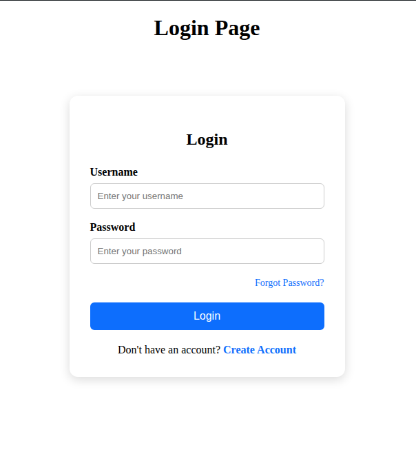
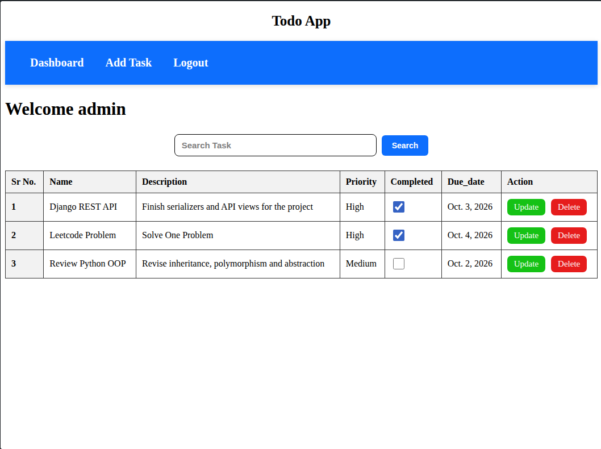
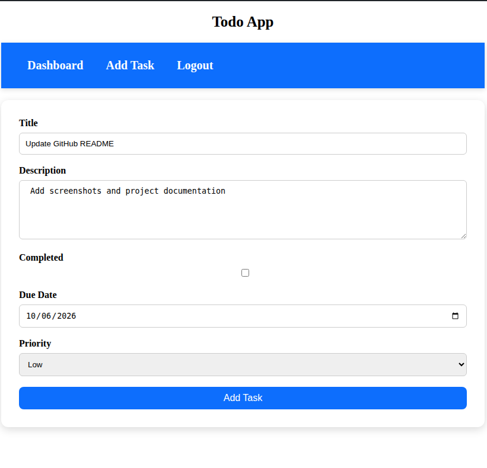

## 📌 About the Project

Django Todo App is a web-based task management application that allows
authenticated users to manage their daily tasks efficiently.

Users can create, update, delete, search, prioritize, and track the
completion status of their tasks from a centralized dashboard.

## 📸 Screenshots

### Login

### Dashboard

### Add Todo

## ⚙️ Installation & Setup

### Clone the repository

git clone https://github.com/TusharKumar-786/django-todo-app.git

### Navigate into the project

cd django-todo-app

### Create virtual environment

python3 -m venv venv

### Activate virtual environment

source venv/bin/activate

### Install dependencies

pip install -r requirements.txt

### Apply migrations

python manage.py migrate

### Create superuser

python manage.py createsuperuser

### Run development server

python manage.py runserver

## 👨‍💻 Author

### Tushar Kumar

B.Tech Computer Science & Engineering

GitHub: @TusharKumar-786
